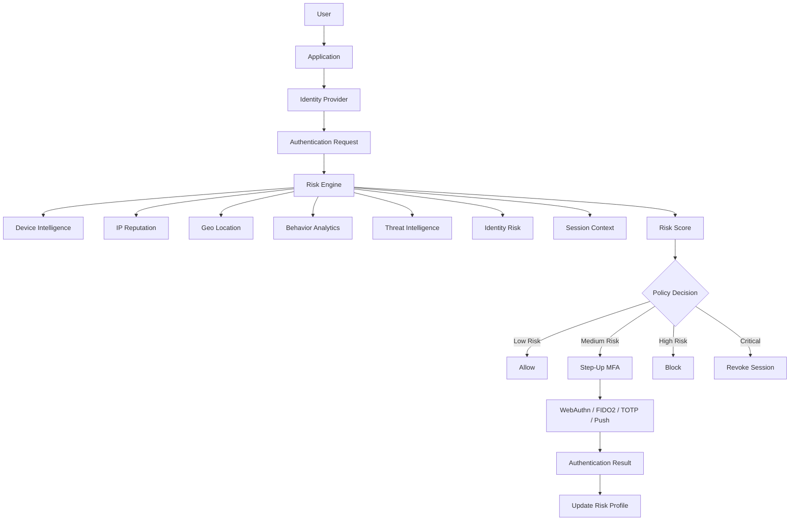
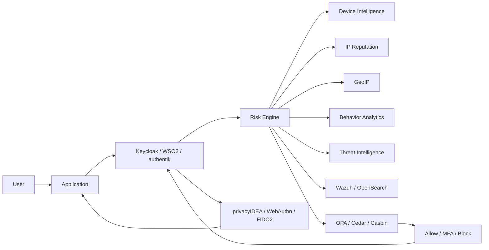
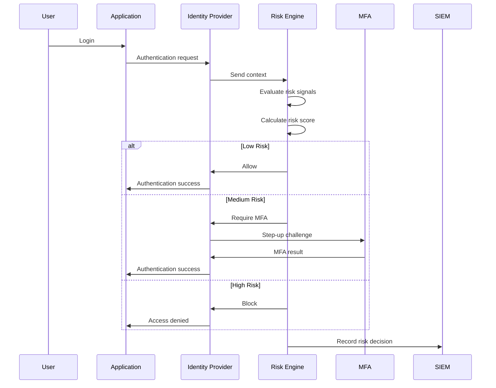
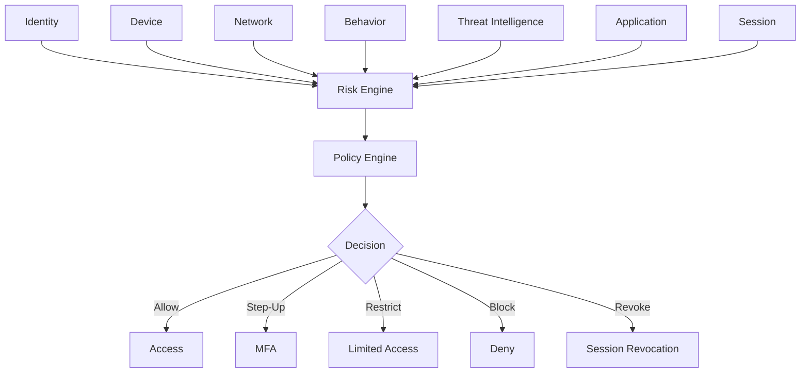
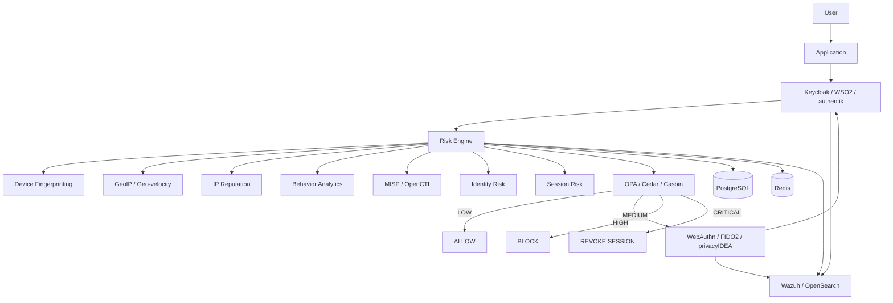
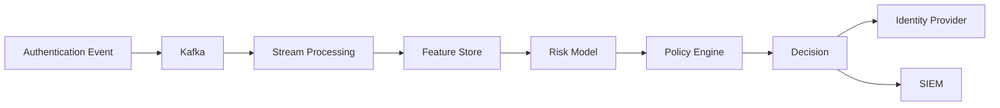
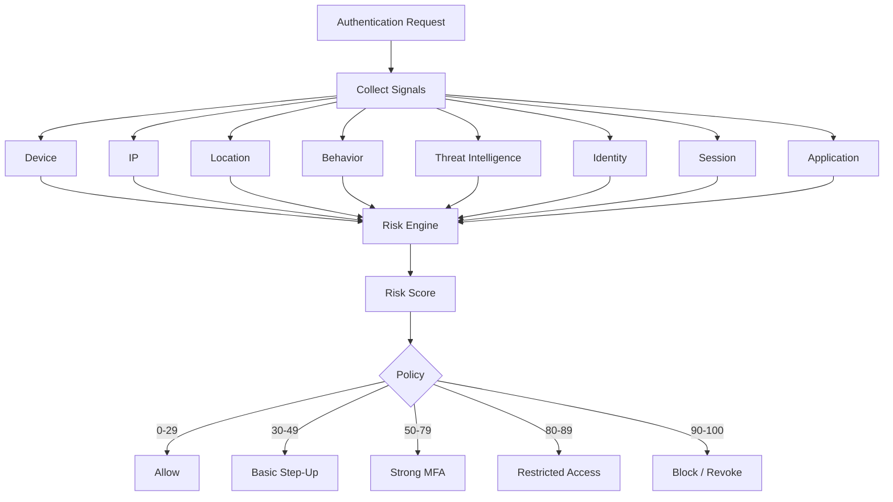

<p align="center">
  
</p>

<p align="center">
  <a href="https://github.com/ishandutta2007/Awesome-Awesome-Awesome"></a>
  <a href="https://discord.gg/jc4xtF58Ve"></a>
  <a href="https://github.com/ishandutta2007"></a>
</p>

# 🛡️ Awesome Risk-Based Authentication

> 🔐 A definitive curated index, benchmark, and architectural guide to enterprise **Risk-Based Authentication (RBA)**, **Adaptive Multi-Factor Authentication (MFA)**, **Continuous Adaptive Trust (CAEP/SSE)**, and **Identity Threat Detection & Response (ITDR)** — featuring verified commercial SaaS pricing, free tier limits, market size analysis, and battle-tested open-source alternatives sorted by GitHub_Stars.

### 🔍 Quick Discovery & Topics
`risk-based-authentication` • `adaptive-mfa` • `step-up-authentication` • `continuous-authentication` • `zero-trust-identity` • `identity-threat-detection` • `itdr` • `behavioral-biometrics` • `device-fingerprinting` • `conditional-access` • `passkeys` • `fido2` • `keycloak` • `authentik` • `open-policy-agent`

---

## 📑 Table of Contents

* [🧐 What Is Risk-Based Authentication?](#-what-is-risk-based-authentication)
* [⚙️ Core RBA Capabilities](#️-core-rba-capabilities)
* [🏢 SaaS / Hosted Platforms](#-saas--hosted-platforms)
* [🔓 Open-Source](#-open-source)
  * [⭐ Top Open-Source Projects Table (Sorted by Stars)](#-top-open-source-projects-table-sorted-by-stars)
  * [📦 Open-Source RBA Platforms](#-open-source-rba-platforms)
  * [🔑 Open-Source Identity and MFA](#-open-source-identity-and-mfa)
  * [⚡ Risk Engines and Policy Engines](#-risk-engines-and-policy-engines)
  * [🧠 Behavioral and Continuous Authentication](#-behavioral-and-continuous-authentication)
  * [📱 Device and Fingerprinting](#-device-and-fingerprinting)
  * [🌐 Threat Intelligence and IP Reputation](#-threat-intelligence-and-ip-reputation)
  * [🚨 Fraud and Anomaly Detection](#-fraud-and-anomaly-detection)
  * [📜 Policy and Access Control](#-policy-and-access-control)
  * [🔐 Authentication Protocols](#-authentication-protocols)
  * [📊 Security Analytics and SIEM](#-security-analytics-and-siem)
* [🗺️ Commercial → Open-Source Mapping](#️-commercial--open-source-mapping)
* [🏛️ RBA Architecture](#️-rba-architecture)
* [📐 Reference Architecture](#-reference-architecture)
* [🔄 Adaptive MFA Flow](#-adaptive-mfa-flow)
* [🎲 Risk Scoring](#-risk-scoring)
* [⚡ Continuous Authentication](#-continuous-authentication)
* [🛡️ Zero Trust Architecture](#️-zero-trust-architecture)
* [🧩 Open-Source RBA Stack](#-open-source-rba-stack)
* [📊 Capability Matrix](#-capability-matrix)
* [🛠️ Recommended Open-Source Stacks](#️-recommended-open-source-stacks)
* [⚖️ What Open Source Can Replace](#️-what-open-source-can-replace)
* [⚠️ What Open Source Cannot Replace Automatically](#️-what-open-source-cannot-replace-automatically)
* [🔒 Security Considerations](#-security-considerations)
* [📜 Licensing Considerations](#-licensing-considerations)
* [🎯 Project Selection Guide](#-project-selection-guide)
* [📋 Top Open-Source Shortlist](#-top-open-source-shortlist)
* [📈 Star History](#-star-history)
* [📄 Disclaimer](#-disclaimer)

---


# 🧐 What Is Risk-Based Authentication?

Risk-Based Authentication is an adaptive authentication model in which the authentication requirement changes according to the estimated risk of an access request.

Typical inputs include:

* Username / identity
* Device identity
* Device posture
* Browser characteristics
* IP address
* ASN
* IP reputation
* VPN / Tor / proxy detection
* Geolocation
* Geo-velocity
* Time of day
* Login frequency
* Historical behavior
* Authentication history
* Failed-login patterns
* Credential compromise
* Threat intelligence
* Application sensitivity
* User role
* Network trust
* Session age
* Transaction context
* Behavioral biometrics
* Anomaly detection
* Previous MFA results

The resulting risk can determine whether the system:

```text
ALLOW
CHALLENGE
STEP-UP MFA
REAUTHENTICATE
RESTRICT
BLOCK
```

Microsoft Entra ID Protection, for example, calculates user and sign-in risk and can feed those signals into Conditional Access policies that require MFA, remediation, reauthentication, or blocking.

---

# ⚙️ Core RBA Capabilities

| Capability                | Description                                              |
| ------------------------- | -------------------------------------------------------- |
| Risk scoring              | Calculate authentication risk                            |
| Adaptive MFA              | Increase authentication requirements when risk rises     |
| Step-up authentication    | Require additional factors only when necessary           |
| Device intelligence       | Identify trusted/untrusted devices                       |
| IP intelligence           | Detect malicious or suspicious IP addresses              |
| Geolocation               | Analyze geographic context                               |
| Impossible travel         | Detect unrealistic geographic movement                   |
| Behavioral analytics      | Compare current behavior with historical behavior        |
| Threat intelligence       | Incorporate external security intelligence               |
| Credential intelligence   | Detect leaked or compromised credentials                 |
| Session risk              | Continuously evaluate an authenticated session           |
| Continuous authentication | Revalidate identity after initial login                  |
| Policy engine             | Translate risk into access decisions                     |
| Risk remediation          | Allow users to recover from risky authentication         |
| Risk-based passwordless   | Combine strong authentication with risk                  |
| Transaction risk          | Increase authentication for sensitive operations         |
| Identity risk             | Evaluate the probability that an identity is compromised |
| Workload risk             | Evaluate non-human/service identities                    |
| SIEM integration          | Export risk events                                       |
| API integration           | Allow applications to consume risk decisions             |

---

# 🏢 SaaS / Hosted Platforms

> This section intentionally remains separate from the Open-Source section.
> Not every product below is strictly SaaS-only; the category includes commercial cloud, hosted, enterprise, and hybrid RBA / Identity Threat Protection platforms.
>
> 📊 **Market Size & Landscape Dynamics**: The global Risk-Based Authentication (RBA) and Adaptive Authentication market is estimated at **$4.5B–$6.0B** (projected to exceed **$18B+ by 2032** growing at a CAGR of ~20.5%). The sector is **moderately fragmented**: while cloud platform titans (Microsoft, Cisco, IBM) dominate core enterprise directory infrastructure and baseline MFA, specialized identity threat protection and CIAM innovators (Okta, Ping Identity, Silverfort, CrowdStrike, Cloudflare) capture substantial enterprise workload share across hybrid Active Directory, zero-trust network access, and legacy protocols, preventing a single winner-take-all monopoly.

*The table below lists leading SaaS and commercial RBA platforms sorted in descending order by company valuation, market capitalization, or annual revenue.*

| Platform 🏢 | Description & Primary Focus 📝 | Company Size / Valuation 💰 | Starting Pricing 🏷️ | Free Tier Limit / Free Trial Details 🎁 |
| :--- | :--- | :--- | :--- | :--- |
| **[Microsoft Entra ID Protection](https://www.microsoft.com/security/business/identity-access/microsoft-entra-id-protection)** | Identity security and risk engine detecting user and sign-in risks, automating risk-based Conditional Access, detecting password spray and token theft, and enforcing step-up MFA remediation. | **$3.10T Market Cap**<br>*(Microsoft: ~$245B+ Rev)* | Included in Entra ID P2 at **$9.00/user/month** (or Microsoft Entra Suite at **$12.00/user/month**, or bundled in Microsoft 365 E5 at **$57.00/user/month**; billed annually). | **Free forever** for Microsoft Entra ID Free (basic directory & baseline MFA; excludes risk-based Conditional Access); **30-day free trial** of Entra ID P2 for up to 100 users. |
| **[Microsoft Defender for Identity](https://www.microsoft.com/security/business/identity-access/microsoft-defender-for-identity)** | Active Directory domain-sensor security monitoring that detects compromised identities, lateral movement paths, pass-the-hash attacks, and feeds real-time risk telemetry into Entra ID Protection. | **$3.10T Market Cap**<br>*(Microsoft: ~$245B+ Rev)* | Standalone license starts at **$5.50/user/month** (or included in Enterprise Mobility + Security E5 at **$16.40/user/month**, or Microsoft 365 E5 at **$57.00/user/month**; billed annually). | **30-day free trial** via Microsoft 365 E5 or Microsoft Defender XDR trial (includes up to 25 user licenses with full Active Directory sensor deployment and threat telemetry; no perpetual free tier). |
| **[IBM Verify](https://www.ibm.com/products/verify)** | Enterprise identity platform featuring AI-powered adaptive access, continuous risk scoring, contextual step-up MFA, passwordless login, and hybrid identity governance. | **$210B Market Cap**<br>*(IBM: ~$62B+ Rev)* | Modular SaaS pricing starting at **$1.66–$1.81/user/month** for Adaptive Access module (comprehensive Workforce packages start at **~$3.50–$5.00/user/month**; CIAM starts at **$0.025/active user/month**). | **90-day free trial** with full access to SSO, MFA, Adaptive Access, and Identity Analytics across unlimited applications (no credit card required; no perpetual free tier). |
| **[Cisco Duo](https://duo.com/)** | Adaptive authentication and Zero Trust access featuring Risk-Based Factor Selection, Risk-Based Remembered Devices, device health inspection, and phishing-resistant MFA. | **~$200B+ Market Cap**<br>*(Cisco: ~$54B Rev)* | Duo Essentials starts at **$3.00/user/month**; Duo Advantage (includes Risk-Based Authentication & Factor Selection) starts at **$6.00/user/month**; Duo Premier at **$9.00/user/month** (billed annually). | **Free forever for up to 10 users** (includes core MFA, Duo Mobile push, passcodes, SSO, and app integrations); **30-day free trial** of Duo Advantage for unlimited test users (telephony excluded). |
| **[Cisco Secure Access](https://www.cisco.com/)** | Converged Security Service Edge (SSE) platform integrating continuous identity risk evaluation, ZTNA, device posture validation, Cisco Talos threat intelligence, and adaptive access policies. | **~$200B+ Market Cap**<br>*(Cisco: ~$54B Rev)* | DNS & Internet security starting tier at **$2.25–$4.00/user/month**; complete Cisco Secure Access SSE suite starts at **~$7.50–$15.00/user/month** (billed annually, min 50 users / ~$4,500/year). | **14-day to 21-day free trial** (standard self-service evaluation covering full SSE and zero-trust private access capabilities for up to 50 users; no perpetual free tier). |
| **[CrowdStrike Falcon Identity Protection](https://www.crowdstrike.com/)** | Identity Threat Detection and Response (ITDR) offering real-time hybrid AD and Entra ID attack detection, behavioral baselining, and automated conditional step-up MFA enforcement. | **~$60B+ Market Cap**<br>*(CrowdStrike: ~$3.5B+ Rev)* | Licensed per active identity starting at **~$3.50–$6.00/identity/month** (~$42.00–$72.00/identity/year) as an add-on, or via Falcon Elite bundles starting at **~$180.00/endpoint/year** (annual contract min ~$5,000–$10,000/year). | **15-day free trial** of the CrowdStrike Falcon platform (includes Next-Gen Identity Security and Falcon Identity Protection module evaluation, no credit card required; no perpetual free tier). |
| **[Cloudflare Zero Trust](https://www.cloudflare.com/zero-trust/)** | Edge-native Zero Trust network access (ZTNA) and Secure Web Gateway with device posture validation, contextual risk signals, conditional step-up policies, and browser isolation. | **~$30B Market Cap**<br>*(Cloudflare: ~$1.5B Rev)* | Free tier is **$0.00/month**; Standard Pay-as-you-go plan starts at **$7.00/user/month**; Enterprise contracts start at **$14.00–$20.00/user/month** (billed monthly or annually). | **Free forever for up to 50 users** (includes full ZTNA, Secure Web Gateway DNS/HTTP filtering, WARP client, 24-hour log retention, and up to 3 physical network locations). |
| **[Okta Adaptive MFA](https://www.okta.com/)** | Behavioral intelligence and risk engine assessing device trust, network, location velocity, ThreatInsight IP reputation, and dynamic step-up authentication. | **~$15B Market Cap**<br>*(Okta: ~$2.4B+ Rev)* | Standalone Adaptive MFA is **$6.00/user/month** (billed annually; subject to Okta's **$1,500/year minimum contract spend**); included in Workforce Identity Cloud Essentials Suite at **$17.00/user/month**. | **30-day free trial** of Okta Workforce Identity Cloud (full access to Adaptive MFA, SSO, ThreatInsight, and Universal Directory for up to 100 test users; no perpetual free tier). |
| **[Auth0 Adaptive MFA](https://auth0.com/)** | Developer-first CIAM and adaptive security featuring Attack Protection, impossible travel anomaly detection, brute-force defense, breached password alerts, and dynamic step-up challenges. | **~$15B Market Cap**<br>*(Okta acquired Auth0 for $6.5B)* | B2C Essentials starts at **$35.00/month** (up to 500 MAU; $150.00/month for B2B); Professional starts at **$240.00/month**; Enterprise tier with Adaptive MFA add-on starts at **~$1,000.00–$2,000.00/month** (~$12,000–$24,000/year). | **Free forever for up to 25,000 Monthly Active Users (MAUs)** (includes unlimited social logins, passwordless login, 1 custom domain, and basic attack protection; Adaptive MFA requires Enterprise); **22-day free trial** of Enterprise features. |
| **[Ping Identity](https://www.pingidentity.com/)** | Adaptive authentication platform evaluating contextual signals (location, device, IP, user behavior) with dynamic policy trees, adaptive MFA step-up, and workforce/CIAM federation. | **~$2.8B Valuation**<br>*(Thoma Bravo; ~$350M+ ARR)* | PingOne for Workforce Essential starts at **$3.00/user/month**; PingOne Plus (with adaptive MFA and risk policies) starts at **$6.00/user/month** (billed annually; enterprise contracts typically require ~$15,000–$50,000/year minimums). | **30-day free trial** of PingOne (includes complete access to adaptive MFA, risk management, user directories, and SSO for up to 100 test users; no perpetual free tier). |
| **[ForgeRock](https://www.forgerock.com/)** | Dynamic identity orchestration journeys supporting behavioral biometrics, device intelligence, continuous contextual evaluation, and adaptive step-up authentication (PingOne Advanced Identity Cloud). | **~$2.3B Valuation**<br>*(Merged with Ping Identity)* | Base enterprise cloud tier starts at **~$2.00–$4.00/user/month** or **~$8,000/month** (~$96,000/year baseline enterprise contract scaled by MAU; CIAM tiers start at ~$0.03/MAU/month). | **30-day guided Proof of Concept (PoC) / sandbox trial** with full access to identity orchestration journeys and adaptive authentication nodes (no perpetual free tier). |
| **[RSA Adaptive Authentication](https://www.rsa.com/)** | Machine learning risk engine, behavioral analytics, device fingerprinting, fraud detection, and transaction monitoring for dynamic step-up MFA across hybrid IT (RSA ID Plus). | **~$2.0B+ Valuation**<br>*(Clearlake / STG; ~$300M+ Rev)* | RSA ID Plus E1 starts at **$3.00/user/month**; ID Plus E2/E3 (includes advanced risk engine, behavioral analytics, and contextual access) starts at **$5.00–$7.00/user/month** (billed annually, min 100 users / ~$3,600–$6,000/year base). | **45-day free trial** of RSA ID Plus (includes MFA, SSO, risk engine, and passwordless authentication for up to 50 test users; no perpetual free tier). |
| **[OneLogin](https://www.onelogin.com/)** | Contextual access management featuring SmartFactor Authentication, Vigilance AI machine learning risk scoring, device trust policies, SSO, and adaptive step-up MFA. | **~$1.5B Parent Valuation**<br>*(One Identity / Quest; ~$500M Rev)* | Advanced plan starts at **$4.00/user/month**; Enterprise tier with SmartFactor Authentication and Vigilance AI risk scoring starts at **$8.00/user/month** (billed annually; minimum contract of ~$1,500/year). | **30-day free trial** of OneLogin Enterprise (full access to SmartFactor Authentication, Vigilance AI risk engine, adaptive MFA, and SSO for up to 50 test users; no credit card required; no perpetual free tier). |
| **[Silverfort](https://www.silverfort.com/)** | Agentless unified identity protection platform that enforces risk-based authentication and MFA across Active Directory, legacy protocols (Kerberos, NTLM), command-line tools, service accounts, and cloud IAM. | **~$1.0B Valuation**<br>*(Series D, ~$50M ARR)* | Starts at **~$3.00–$6.00/user/month** (~$36.00–$72.00/user/year) with enterprise deployments typically starting at a **$20,000/year minimum contract spend** (or 250-user minimum). | **14-day to 30-day Proof of Concept (PoC) free trial** in an organization's active directory/scoped environment (includes Identity Security Assessment identifying unmanaged service accounts and MFA gaps; no perpetual free tier). |
| **[SecureAuth](https://www.secureauth.com/)** | Arculix Risk Engine delivering continuous behavioral authentication, device fingerprinting, invisible MFA, geo-velocity checks, and threat intelligence-driven step-up access. | **~$300M Valuation**<br>*(ARR: ~$40M+)* | Base MFA starts at **$1.50–$2.00/user/month**; full Arculix continuous risk engine & adaptive authentication package starts at **$3.00–$5.00/user/month** (billed annually, annual contract minimum ~$5,000/year). | **14-day free trial** of SecureAuth CIAM and Arculix passwordless authentication (full evaluation of adaptive risk engine and step-up flows; no perpetual free tier). |

---

# 🔓 Open-Source

> **Important distinction:** There is no single universally adopted open-source drop-in replacement for Duo RBA, Silverfort, Okta Adaptive MFA or Microsoft Entra ID Protection.
>
> The open-source ecosystem is instead composed of:
> 1. Identity providers
> 2. MFA engines
> 3. Authentication policy engines
> 4. Risk engines
> 5. Behavioral analytics
> 6. Device intelligence
> 7. Threat-intelligence systems
> 8. SIEM/logging
> 9. Policy-as-code engines
> 10. Machine-learning infrastructure
>
> Combining these components can produce a highly capable self-hosted RBA platform.

### ⭐ Open-Source Projects Table (Sorted by Stars)

*Each repository includes a live GitHub star badge that links directly to its stargazers page.*

| Repository 📦 | GitHub_Stars 🌟 | Focus Area 📂 | Description & Role 🚀 |
| :--- | :--- | :--- | :--- |
| **[Elasticsearch](https://github.com/elastic/elasticsearch)** | [](https://github.com/elastic/elasticsearch/stargazers) | Security Analytics & Telemetry | Distributed search and analytics engine for centralizing authentication logs, behavioral analysis, and anomaly detection. |
| **[Headscale](https://github.com/juanfont/headscale)** | [](https://github.com/juanfont/headscale/stargazers) | Self-Hosted Zero Trust Mesh | Open-source control server for Tailscale WireGuard overlay networks enforcing identity-aware access rules. |
| **[Keycloak](https://github.com/keycloak/keycloak)** | [](https://github.com/keycloak/keycloak/stargazers) | Identity & Adaptive Auth Flows | Leading open-source identity and access management platform supporting conditional authentication flows, adaptive MFA, and WebAuthn. |
| **[Authelia](https://github.com/authelia/authelia)** | [](https://github.com/authelia/authelia/stargazers) | Authentication & Access Control | Lightweight authentication and authorization server providing 2FA/MFA, WebAuthn, TOTP, and reverse-proxy policy enforcement. |
| **[FingerprintJS](https://github.com/fingerprintjs/fingerprintjs)** | [](https://github.com/fingerprintjs/fingerprintjs/stargazers) | Browser & Device Fingerprinting | Client-side browser and device fingerprinting library providing hardware and environment signals for risk scoring. |
| **[authentik](https://github.com/goauthentik/authentik)** | [](https://github.com/goauthentik/authentik/stargazers) | Identity & Expression Policies | Open-source IdP with flexible Python expression policies, MFA enforcement, user flows, and modern directory integrations. |
| **[Teleport](https://github.com/gravitational/teleport)** | [](https://github.com/gravitational/teleport/stargazers) | Zero Trust Access & Per-Session MFA | Identity-native infrastructure access proxy with device trust inspection, per-session MFA challenges, and continuous audit. |
| **[Casbin](https://github.com/casbin/casbin)** | [](https://github.com/casbin/casbin/stargazers) | Authorization Library | Powerful authorization library supporting access control models including ACL, RBAC, ABAC, and RESTful path-based policies. |
| **[Wazuh](https://github.com/wazuh/wazuh)** | [](https://github.com/wazuh/wazuh/stargazers) | SIEM & Threat Detection | Open-source security monitoring and XDR platform correlating endpoint events, authentication logs, and threat indicators. |
| **[SuperTokens](https://github.com/supertokens/supertokens-core)** | [](https://github.com/supertokens/supertokens-core/stargazers) | Auth & Session Risk Management | Modular open-source authentication solution featuring session theft protection, rolling session tokens, and adaptive MFA. |
| **[ZITADEL](https://github.com/zitadel/zitadel)** | [](https://github.com/zitadel/zitadel/stargazers) | Cloud-Native IAM & Passkeys | Cloud-native identity platform with turnkey multi-tenancy, passkey/WebAuthn support, and contextual session validation. |
| **[CrowdSec](https://github.com/crowdsecurity/crowdsec)** | [](https://github.com/crowdsecurity/crowdsec/stargazers) | Crowdsourced Threat Intel & IPS | Open-source collaborative intrusion prevention system and IP reputation network detecting brute-force and malicious login attempts. |
| **[Logto](https://github.com/logto-io/logto)** | [](https://github.com/logto-io/logto/stargazers) | Modern IAM & CIAM | Developer-friendly alternative to Auth0 supporting enterprise SSO, MFA, passwordless login, and webhook security triggers. |
| **[Casdoor](https://github.com/casdoor/casdoor)** | [](https://github.com/casdoor/casdoor/stargazers) | UI-First IAM & Federation | UI-centric identity management and SSO platform supporting OAuth2, OIDC, SAML, WebAuthn, and multi-factor step-up authentication. |
| **[Ory Kratos](https://github.com/ory/kratos)** | [](https://github.com/ory/kratos/stargazers) | Headless IAM & MFA | Cloud-native identity and user management system supporting multi-factor authentication, passkeys, and risk-aware self-service flows. |
| **[OpenSearch](https://github.com/opensearch-project/OpenSearch)** | [](https://github.com/opensearch-project/OpenSearch/stargazers) | Search & Anomaly Detection | Open-source search and analytics suite offering automated anomaly detection on authentication telemetry and login events. |
| **[Open Policy Agent (OPA)](https://github.com/open-policy-agent/opa)** | [](https://github.com/open-policy-agent/opa/stargazers) | Policy-as-Code Engine | General-purpose policy engine enabling context-aware risk evaluations, attribute-based access decisions, and decoupled auth rules. |
| **[OpenCTI](https://github.com/OpenCTI-Platform/opencti)** | [](https://github.com/OpenCTI-Platform/opencti/stargazers) | Cyber Threat Intelligence | Open-source platform for structuring, correlating, and consuming threat intelligence feeds and malicious IP reputation. |
| **[Falco](https://github.com/falcosecurity/falco)** | [](https://github.com/falcosecurity/falco/stargazers) | Runtime Threat Detection | De facto Kubernetes threat detection engine analyzing system calls and behavioral anomalies in real time. |
| **[MISP](https://github.com/MISP/MISP)** | [](https://github.com/MISP/MISP/stargazers) | Threat Sharing & Indicators | Open-source threat sharing and indicator correlation platform tracking malicious IPs, compromised credentials, and botnets. |
| **[OpenFGA](https://github.com/openfga/openfga)** | [](https://github.com/openfga/openfga/stargazers) | Relationship-Based Authorization | Zanzibar-inspired open-source fine-grained authorization engine designed for complex resource permissions and context checks. |
| **[Ory Keto](https://github.com/ory/keto)** | [](https://github.com/ory/keto/stargazers) | Access Control & Zanzibar Server | High-performance access control server implementing Google Zanzibar relation-based access control (ReBAC). |
| **[Kanidm](https://github.com/kanidm/kanidm)** | [](https://github.com/kanidm/kanidm/stargazers) | Identity Directory & WebAuthn | Modern, fast identity directory and authentication server written in Rust with built-in passkey and WebAuthn support. |
| **[HashiCorp Boundary](https://github.com/hashicorp/boundary)** | [](https://github.com/hashicorp/boundary/stargazers) | Identity-Based Privileged Access | Identity-aware access management for secure infrastructure access without exposing underlying private networks. |
| **[TheHive](https://github.com/TheHive-Project/TheHive)** | [](https://github.com/TheHive-Project/TheHive/stargazers) | Security Incident Response | Scalable security incident response platform integrated with MISP for investigating compromised user accounts. |
| **[Shuffle](https://github.com/Shuffle/Shuffle)** | [](https://github.com/Shuffle/Shuffle/stargazers) | Open-Source SOAR & Remediation | Open-source security orchestration and automated response platform for automated risk remediation and account lockouts. |
| **[ClientJS](https://github.com/jackspirou/clientjs)** | [](https://github.com/jackspirou/clientjs/stargazers) | Browser Fingerprinting | Pure JavaScript device and browser fingerprinting library for collecting client-side environment attributes. |
| **[privacyIDEA](https://github.com/privacyidea/privacyidea)** | [](https://github.com/privacyidea/privacyidea/stargazers) | Enterprise Multi-Factor Auth | Modular authentication and token management system supporting WebAuthn, TOTP, push tokens, and adaptive MFA workflows. |
| **[Cedar](https://github.com/cedar-policy/cedar)** | [](https://github.com/cedar-policy/cedar/stargazers) | Policy-as-Code Language | AWS-originated expressive policy language for fine-grained contextual authorization and dynamic access control. |
| **[FreeIPA](https://github.com/freeipa/freeipa)** | [](https://github.com/freeipa/freeipa/stargazers) | Identity & Domain Security | Integrated identity management system providing centralized LDAP, Kerberos, DNS, and host-level certificate policies. |
| **[WSO2 Identity Server](https://github.com/wso2/product-is)** | [](https://github.com/wso2/product-is/stargazers) | Enterprise RBA & Adaptive IAM | Enterprise IAM platform with native adaptive authentication scripts, behavioral risk scoring, and geo-velocity evaluation. |
| **[ua-parser](https://github.com/ua-parser/uap-core)** | [](https://github.com/ua-parser/uap-core/stargazers) | User-Agent Parsing Engine | Regex-based cross-language user-agent parser for extracting OS, browser, and device telemetry from HTTP headers. |
| **[Gluu / Janssen](https://github.com/JanssenProject/jans)** | [](https://github.com/JanssenProject/jans/stargazers) | Cloud-Native IAM & FIDO2 | Cloud-native Linux Foundation identity platform with FIDO2/WebAuthn, UMA, and custom scriptable authentication steps. |
| **[Apache Syncope](https://github.com/apache/syncope)** | [](https://github.com/apache/syncope/stargazers) | Enterprise Identity Lifecycle | Open-source digital identity management system for managing identity lifecycle, provisioning, and governance. |
| **[OpenSearch Security Analytics](https://github.com/opensearch-project/security-analytics)** | [](https://github.com/opensearch-project/security-analytics/stargazers) | Security Correlation Engine | OpenSearch plugin providing Sigma rule-based threat detection and automated security event correlation. |
| **[LemonLDAP::NG](https://github.com/LemonLDAPNG/lemonldap-ng)** | [](https://github.com/LemonLDAPNG/lemonldap-ng/stargazers) | Web SSO & Access Control | Modular Web-SSO and identity federation system with fine-grained access rules and session policy enforcement. |

---
>
> The open-source ecosystem is instead composed of:
>
> 1. Identity providers
> 2. MFA engines
> 3. Authentication policy engines
> 4. Risk engines
> 5. Behavioral analytics
> 6. Device intelligence
> 7. Threat-intelligence systems
> 8. SIEM/logging
> 9. Policy-as-code engines
> 10. Machine-learning infrastructure
>
> Combining these components can produce a highly capable self-hosted RBA platform.

---

# 📦 Open-Source RBA Platforms

## 1. WSO2 Identity Server

**GitHub:** https://github.com/wso2/product-is

**Website:** https://wso2.com/identity-server/

One of the strongest open-source candidates for building adaptive authentication.

WSO2 Identity Server supports adaptive authentication and can integrate risk engines and external systems. WSO2 documentation describes contextual signals including device fingerprints, history, geolocation, geo-velocity and behavioral analysis.

**Capabilities**

* Adaptive authentication
* Conditional authentication
* MFA
* SSO
* OAuth2
* OpenID Connect
* SAML
* Identity federation
* Authentication scripts
* Risk-engine integration
* Device context
* Geolocation
* Geo-velocity
* Behavioral analysis

**Best open-source candidate for:**

```text
Enterprise RBA
+
Identity Server
+
Adaptive MFA
```

---

## 2. Keycloak

**GitHub:** https://github.com/keycloak/keycloak

**Website:** https://www.keycloak.org/

Keycloak is one of the most important open-source IAM platforms for building an RBA system.

It provides:

* Authentication flows
* Conditional authenticators
* MFA
* WebAuthn
* TOTP
* OTP
* SSO
* OAuth2
* OpenID Connect
* SAML
* Identity brokering
* User federation
* Custom authenticators
* Custom extensions

Risk scoring can be implemented using custom authenticators, authentication flows, event listeners and external risk engines.

---

## 3. authentik

**GitHub:** https://github.com/goauthentik/authentik

**Website:** https://goauthentik.io/

authentik is an open-source identity provider supporting SAML, OAuth2/OIDC, LDAP, RADIUS and policy-based authentication.

**Useful for RBA**

* Policy engine
* Expression policies
* MFA
* Device/context policies
* SSO
* OAuth2/OIDC
* LDAP
* RADIUS
* Self-hosting

---

## 4. privacyIDEA

**GitHub:** https://github.com/privacyidea/privacyidea

**Website:** https://privacyidea.org/

Open-source authentication and MFA platform.

**Capabilities**

* OTP
* TOTP
* HOTP
* WebAuthn
* FIDO2
* Push authentication integrations
* Token management
* Authentication policies
* LDAP/AD integration
* RADIUS
* REST API

Excellent building block for an open-source adaptive MFA architecture.

---

## 5. Gluu / Janssen

**GitHub:** https://github.com/JanssenProject/jans

**Website:** https://www.jans.io/

Open-source identity and authorization platform.

**Capabilities**

* OAuth2
* OpenID Connect
* FIDO2
* WebAuthn
* UMA
* Authentication
* Authorization
* Identity federation
* Custom authentication flows

---

## 6. LemonLDAP::NG

**GitHub:** https://github.com/LemonLDAPNG/lemonldap-ng

**Website:** https://lemonldap-ng.org/

Open-source Web SSO and access-management platform.

**Capabilities**

* SSO
* Access control
* Authentication
* LDAP
* SAML
* OpenID Connect
* CAS
* Policy enforcement
* Session management

---

## 7. Authelia

**GitHub:** https://github.com/authelia/authelia

Open-source authentication and authorization server.

**Capabilities**

* 2FA
* WebAuthn
* TOTP
* OIDC
* Access control
* Session management
* Reverse-proxy integration

Best suited to smaller/self-hosted environments.

---

## 8. Kanidm

**GitHub:** https://github.com/kanidm/kanidm

Modern open-source identity directory and authentication system.

**Capabilities**

* Passkeys
* WebAuthn
* MFA
* LDAP-compatible directory functions
* OAuth2/OIDC
* Strong authentication

---

## 9. ZITADEL

**GitHub:** https://github.com/zitadel/zitadel

Open-source identity platform supporting:

* OIDC
* OAuth2
* SAML
* MFA
* Passkeys
* Organizations
* Identity federation
* Fine-grained authorization

---

## 10. Casdoor

**GitHub:** https://github.com/casdoor/casdoor

Open-source identity and access management platform.

**Capabilities**

* SSO
* OAuth2
* OIDC
* SAML
* MFA
* Social login
* Identity federation
* Application integration

---

## 11. Apache Syncope

**Website:** https://syncope.apache.org/

Open-source identity management platform.

Useful for:

* Identity lifecycle
* Provisioning
* Policy
* Federation
* Enterprise IAM

---

## 12. Shibboleth

**Website:** https://www.shibboleth.net/

Open-source federation and authentication ecosystem.

Particularly relevant to:

* SAML
* Federation
* Higher education
* Enterprise identity federation

---

## 13. FreeIPA

**Website:** https://www.freeipa.org/

Open-source identity management platform integrating:

* LDAP
* Kerberos
* Certificates
* Host identity
* Policy
* Authentication

Useful as an enterprise identity foundation.

---

# ⚡ Risk Engines and Policy Engines

A major advantage of an open architecture is that the **risk engine can be separated from the identity provider**.

## Open-Source / Open Ecosystem Components

### Open Policy Agent

**GitHub:** https://github.com/open-policy-agent/opa

Policy engine for:

* Authorization
* Contextual decisions
* Attribute-based access control
* Policy-as-code

---

### Cedar

**GitHub:** https://github.com/cedar-policy/cedar

AWS-originated open-source authorization policy language.

Useful for:

* Fine-grained authorization
* Contextual policies
* Attribute-based access

---

### Casbin

**GitHub:** https://github.com/casbin/casbin

Authorization library supporting:

* RBAC
* ABAC
* ACL
* Custom models

---

### OpenFGA

**GitHub:** https://github.com/openfga/openfga

Open-source fine-grained authorization system inspired by Zanzibar.

Useful for:

* Relationship-based authorization
* Resource permissions
* Contextual authorization

---

### Ory Keto

**GitHub:** https://github.com/ory/keto

Open-source authorization server for fine-grained access control.

---

# 🧠 Behavioral and Continuous Authentication

## BehavioSec

**GitHub:** https://github.com/ForgeRock/BehavioSec

The repository provides a continuous-authentication implementation based on behavioral signals such as keystrokes, cursor movements, touch/screen pressure and device handling.

It illustrates an important RBA pattern:

```text
Behavioral Signal
       ↓
Behavioral Score
       ↓
Risk Evaluation
       ↓
Step-Up MFA
       ↓
Allow / Block
```

---

## ⚡ Continuous Authentication System

**GitHub:** https://github.com/ChiUkwuDi/Continuous-Authentication-System

Experimental/open-source continuous authentication implementation using:

* Facial recognition
* Voice
* Keystroke dynamics
* Mouse behavior
* Behavioral biometrics

Useful primarily as a research/building-block project rather than a mature enterprise IAM platform.

---

# 📱 Device and Fingerprinting

Device intelligence is one of the most important RBA inputs.

Useful open-source components include:

## FingerprintJS Open Source

**GitHub:** https://github.com/fingerprintjs/fingerprintjs

Browser/device fingerprinting.

---

## ClientJS

**GitHub:** https://github.com/jackspirou/clientjs

Browser fingerprinting library.

---

## ua-parser

**GitHub:** https://github.com/ua-parser/uap-core

User-agent parsing.

---

## Fingerprint / Device Signals Architecture

```text
Browser
   ↓
Device Fingerprint
   ↓
Device Reputation
   ↓
Historical Device Profile
   ↓
Risk Engine
```

---

# 🌐 Threat Intelligence and IP Reputation

RBA becomes substantially stronger when authentication events are correlated with threat intelligence.

## MISP

**GitHub:** https://github.com/MISP/MISP

Open-source threat-intelligence platform.

Useful for:

* IP indicators
* Domains
* Malware indicators
* Threat actors
* IOC correlation

---

## OpenCTI

**GitHub:** https://github.com/OpenCTI-Platform/opencti

Open-source cyber threat-intelligence platform.

---

## AbuseIPDB

**Website:** https://www.abuseipdb.com/

Useful external IP reputation source.

---

## Spamhaus

**Website:** https://www.spamhaus.org/

IP/domain reputation and threat intelligence.

---

## MaxMind GeoIP

**Website:** https://www.maxmind.com/

Useful for:

* Geolocation
* ASN
* Network intelligence

---

# 🚨 Fraud and Anomaly Detection

## OpenSearch

**GitHub:** https://github.com/opensearch-project/OpenSearch

Useful for:

* Authentication-event analytics
* Anomaly detection
* Search
* Security analytics
* Dashboards

---

## Elasticsearch

**GitHub:** https://github.com/elastic/elasticsearch

Useful for:

* Authentication telemetry
* Behavioral analytics
* Risk-event search
* Anomaly detection

---

## Apache Kafka

**Website:** https://kafka.apache.org/

Event streaming backbone for RBA.

---

## Redis

**Website:** https://redis.io/

Useful for:

* Real-time risk state
* Session risk
* Counters
* Rate limiting
* Temporary reputation data

---

## PostgreSQL

**Website:** https://www.postgresql.org/

Useful for:

* User risk profiles
* Device history
* Authentication history
* Policy data
* Risk decisions

---

# 📜 Policy and Access Control

Important open-source components:

| Project           | Primary Role                   |
| ----------------- | ------------------------------ |
| Open Policy Agent | Policy-as-code                 |
| Cedar             | Authorization policy           |
| Casbin            | RBAC/ABAC                      |
| OpenFGA           | Fine-grained authorization     |
| Ory Keto          | Authorization                  |
| Keycloak          | IAM + authentication policy    |
| WSO2 IS           | IAM + adaptive authentication  |
| authentik         | IAM + policy                   |
| privacyIDEA       | MFA + token policy             |
| LemonLDAP::NG     | SSO + access policy            |
| Authelia          | Authentication + access policy |

---

# 🔐 Authentication Protocols

An RBA architecture should normally support:

* OAuth 2.0
* OpenID Connect
* SAML 2.0
* WebAuthn
* FIDO2
* RADIUS
* LDAP
* Kerberos
* SCIM
* JWT
* mTLS

Important open-source implementations include:

* Keycloak
* WSO2 Identity Server
* authentik
* Janssen
* ZITADEL
* LemonLDAP::NG
* Authelia
* privacyIDEA
* FreeIPA
* Shibboleth
* Ory

---

# 📊 Security Analytics and SIEM

## Wazuh

**GitHub:** https://github.com/wazuh/wazuh

Open-source security monitoring platform.

Useful for:

* Authentication monitoring
* Endpoint telemetry
* Threat detection
* Log analysis
* SIEM/XDR functions

---

## Security Onion

**Website:** https://securityonionsolutions.com/

Open-source security monitoring platform integrating multiple security tools.

---

## OpenSearch Security Analytics

**GitHub:** https://github.com/opensearch-project/security-analytics

Useful for correlating:

```text
Authentication Events
        +
Endpoint Events
        +
Network Events
        +
Threat Intelligence
        ↓
Risk Engine
```

---

# 🗺️ Commercial → Open-Source Mapping

| Commercial Platform           | Open-Source / Open Stack Equivalent                                 |
| ----------------------------- | ------------------------------------------------------------------- |
| Cisco Duo RBA                 | Keycloak + privacyIDEA + OPA + device intelligence                  |
| Silverfort                    | Keycloak/WSO2 + OPA + Wazuh + AD/LDAP + risk engine                 |
| Ping Identity                 | WSO2 IS / Keycloak + OPA + WebAuthn                                 |
| ForgeRock                     | WSO2 IS / Keycloak + adaptive authentication extensions             |
| Okta Adaptive MFA             | Keycloak / authentik / WSO2 + privacyIDEA                           |
| Microsoft Entra ID Protection | Keycloak/WSO2 + OPA + Wazuh + MISP + behavioral analytics           |
| IBM Verify                    | WSO2 IS + Keycloak + OPA + SIEM                                     |
| RSA Adaptive Authentication   | WSO2 + risk engine + ML + threat intelligence                       |
| SecureAuth                    | WSO2 + Keycloak + device fingerprint + GeoIP + behavioral analytics |
| OneLogin                      | authentik / Keycloak / ZITADEL + privacyIDEA                        |
| Adaptive MFA                  | Keycloak + privacyIDEA                                              |
| Continuous Authentication     | Keycloak + behavioral analytics + session-risk engine               |
| Risk-Based Access             | OPA + Keycloak + telemetry                                          |
| Identity Threat Detection     | Wazuh + OpenSearch + MISP                                           |
| Device Risk                   | FingerprintJS + device database + risk engine                       |
| IP Risk                       | MISP + AbuseIPDB + GeoIP + ASN intelligence                         |

---

# 🏛️ RBA Architecture



---

# 📐 Reference Architecture



---

# 🔄 Adaptive MFA Flow



---

# 🎲 Risk Scoring

A simple open-source RBA implementation can start with a weighted model.

```text
Risk Score =
    Device Risk
  + IP Risk
  + Geo Risk
  + Behavior Risk
  + Credential Risk
  + Threat Intelligence Risk
  + Session Risk
  + Application Risk
```

Example:

| Signal                         | Weight |
| ------------------------------ | -----: |
| New device                     |    +20 |
| Unknown IP                     |    +15 |
| Malicious IP                   |    +50 |
| Impossible travel              |    +40 |
| Tor exit node                  |    +30 |
| Abnormal login time            |    +10 |
| Credential leak                |    +50 |
| Failed authentication burst    |    +25 |
| Trusted device                 |    -20 |
| Trusted network                |    -15 |
| Strong WebAuthn authentication |    -30 |

Example policy:

```text
0–29    → Allow
30–49   → Additional verification
50–69   → Strong MFA
70–89   → Restricted access
90–100  → Block
```

> This scoring model is illustrative. Production systems should calibrate thresholds using real authentication telemetry, false-positive rates, attack simulations and business risk.

---

# Risk Decision Engine

A production implementation should separate:

```text
SIGNALS
   ↓
FEATURE ENGINEERING
   ↓
RISK MODEL
   ↓
POLICY ENGINE
   ↓
AUTHENTICATION DECISION
```

For example:

```text
Device = New
IP = Residential
Geo = Normal
Time = Normal
Behavior = Normal
Threat Intel = Clean
Credential = Clean

                ↓

Risk Score = 22

                ↓

ALLOW
```

Whereas:

```text
Device = New
IP = Tor
Geo = Impossible Travel
Behavior = Abnormal
Credential = Leaked

                ↓

Risk Score = 91

                ↓

BLOCK
```

---

# ⚡ Continuous Authentication

Traditional authentication:

```text
LOGIN
  ↓
MFA
  ↓
SESSION
```

Continuous authentication:

```text
LOGIN
  ↓
RISK ASSESSMENT
  ↓
MFA
  ↓
SESSION
  ↓
CONTINUOUS TELEMETRY
  ↓
RISK RE-EVALUATION
  ↓
ALLOW / STEP-UP / REVOKE
```

A possible open-source architecture:

```text
Keycloak
   +
Behavior Analytics
   +
Device Fingerprinting
   +
Wazuh
   +
OpenSearch
   +
OPA
   +
WebAuthn
```

---

# 🛡️ Zero Trust Architecture

RBA fits naturally into Zero Trust.



---

# 🧩 Open-Source RBA Stack

A strong fully self-hosted architecture can look like:

```text
                    ┌───────────────────┐
                    │     USERS         │
                    └─────────┬─────────┘
                              │
                              ▼
                    ┌───────────────────┐
                    │ APPLICATIONS      │
                    └─────────┬─────────┘
                              │
                              ▼
                    ┌───────────────────┐
                    │ KEYCLOAK / WSO2   │
                    └─────────┬─────────┘
                              │
                              ▼
                    ┌───────────────────┐
                    │ RISK ENGINE       │
                    └─────────┬─────────┘
                              │
         ┌────────────────────┼────────────────────┐
         ▼                    ▼                    ▼
   Device Risk          IP Reputation        Behavior
         │                    │                    │
         └────────────────────┼────────────────────┘
                              ▼
                    ┌───────────────────┐
                    │ POLICY ENGINE     │
                    │ OPA / Cedar       │
                    └─────────┬─────────┘
                              │
              ┌───────────────┼───────────────┐
              ▼               ▼               ▼
            ALLOW           MFA             BLOCK
                              │
                              ▼
                    ┌───────────────────┐
                    │ privacyIDEA /      │
                    │ WebAuthn / FIDO2   │
                    └───────────────────┘
```

---

# 📊 Capability Matrix

| Capability                | Duo | Silverfort | Ping | Okta | Entra ID Protection | SecureAuth | WSO2 | Keycloak | privacyIDEA | authentik |
| ------------------------- | --: | ---------: | ---: | ---: | ------------------: | ---------: | ---: | -------: | ----------: | --------: |
| RBA                       |   ✅ |          ✅ |    ✅ |    ✅ |                   ✅ |          ✅ |    ✅ |        ◐ |           ◐ |         ◐ |
| Adaptive MFA              |   ✅ |          ✅ |    ✅ |    ✅ |                   ✅ |          ✅ |    ✅ |        ✅ |           ✅ |         ✅ |
| Risk Engine               |   ✅ |          ✅ |    ✅ |    ✅ |                   ✅ |          ✅ |    ✅ |        ◐ |           ◐ |         ◐ |
| Device Intelligence       |   ✅ |          ✅ |    ✅ |    ✅ |                   ✅ |          ✅ |    ✅ |        ◐ |           ◐ |         ◐ |
| Behavioral Analytics      |   ✅ |          ✅ |    ✅ |    ✅ |                   ✅ |          ✅ |    ✅ |        ◐ |           ❌ |         ◐ |
| Geo Risk                  |   ✅ |          ✅ |    ✅ |    ✅ |                   ✅ |          ✅ |    ✅ |        ◐ |           ◐ |         ◐ |
| IP Reputation             |   ✅ |          ✅ |    ✅ |    ✅ |                   ✅ |          ✅ |    ◐ |        ◐ |           ◐ |         ◐ |
| Continuous Authentication |   ✅ |          ✅ |    ✅ |    ◐ |                   ✅ |          ✅ |    ◐ |        ◐ |           ◐ |         ◐ |
| WebAuthn                  |   ✅ |          ✅ |    ✅ |    ✅ |                   ✅ |          ✅ |    ✅ |        ✅ |           ✅ |         ✅ |
| SSO                       |   ✅ |          ✅ |    ✅ |    ✅ |                   ✅ |          ✅ |    ✅ |        ✅ |           ◐ |         ✅ |
| Open Source               |   ❌ |          ❌ |    ❌ |    ❌ |                   ❌ |          ❌ |    ✅ |        ✅ |           ✅ |         ✅ |
| Self-hosted               |   ◐ |          ◐ |    ◐ |    ❌ |                   ◐ |          ◐ |    ✅ |        ✅ |           ✅ |         ✅ |

Legend:

```text
✅ = Strong/native capability
◐ = Possible through configuration/extensions/integration
❌ = Not the primary capability
```

---

# 🛠️ Recommended Open-Source Stacks

## 1. Best Overall Enterprise RBA

```text
WSO2 Identity Server
+
OPA
+
privacyIDEA
+
MISP
+
MaxMind GeoIP
+
OpenSearch
+
Wazuh
+
PostgreSQL
+
Redis
```

**Best for:**

* Enterprise IAM
* Adaptive authentication
* Risk-based MFA
* SIEM integration
* Self-hosting

---

# 2. Best Keycloak-Centric Architecture

```text
Keycloak
+
Custom Risk Engine
+
OPA
+
privacyIDEA
+
FingerprintJS
+
MISP
+
GeoIP
+
Redis
+
PostgreSQL
+
OpenSearch
```

**Best for:**

* Developers
* Custom IAM
* Kubernetes
* Cloud-native applications
* OIDC/OAuth2 environments

---

# 3. Best Lightweight Architecture

```text
authentik
+
WebAuthn
+
OPA
+
Redis
+
GeoIP
+
OpenSearch
```

**Best for:**

* SMB
* Homelab
* Internal applications
* Self-hosted infrastructure

---

# 4. Best MFA-Focused Architecture

```text
Keycloak
+
privacyIDEA
+
WebAuthn
+
FIDO2
+
OPA
```

**Best for:**

```text
Adaptive MFA
+
Strong Authentication
+
Policy Enforcement
```

---

# 5. Best Security-Analytics Architecture

```text
Keycloak
+
Wazuh
+
OpenSearch
+
MISP
+
OPA
+
Redis
+
privacyIDEA
```

Authentication events flow into the security analytics layer:

```text
Authentication
      ↓
Risk Events
      ↓
Wazuh
      ↓
OpenSearch
      ↓
Risk Correlation
      ↓
Policy Decision
      ↓
MFA / Allow / Block
```

---

# ⚖️ What Open Source Can Replace

With the correct architecture, open-source components can reproduce a substantial portion of commercial RBA functionality.

### Can be reproduced

* Adaptive MFA
* Risk-based MFA
* Contextual authentication
* Device trust
* IP risk
* Geo risk
* Impossible travel
* Authentication history
* Behavioral scoring
* Threat-intelligence correlation
* Risk scoring
* Policy-based access
* Step-up authentication
* WebAuthn
* FIDO2
* TOTP
* Session revocation
* SIEM integration
* Identity federation
* OAuth2
* OIDC
* SAML
* RADIUS
* LDAP
* Custom risk models
* ML-based anomaly detection

---

# ⚠️ What Open Source Cannot Replace Automatically

The important limitation is that open-source components do **not automatically provide the enormous proprietary telemetry networks and detection models** behind some commercial platforms.

For example, an open-source Keycloak installation does not automatically provide:

```text
Global threat intelligence
+
Billions of authentication events
+
Proprietary behavioral models
+
Commercial device reputation
+
Commercial fraud intelligence
+
Vendor-specific identity telemetry
```

Commercial platforms may therefore have an advantage in:

* Global reputation intelligence
* Proprietary behavioral models
* Detection engineering
* Managed threat intelligence
* Vendor-maintained ML models
* Enterprise support
* Integrated device intelligence
* Managed infrastructure
* Large-scale telemetry

The open-source advantage is:

```text
CONTROL
+
CUSTOMIZATION
+
SELF-HOSTING
+
TRANSPARENCY
+
NO VENDOR LOCK-IN
```

---

# Open-Source RBA vs Commercial RBA

| Area                    | Commercial     | Open Source                  |
| ----------------------- | -------------- | ---------------------------- |
| Identity Provider       | Excellent      | Excellent                    |
| MFA                     | Excellent      | Excellent                    |
| WebAuthn                | Excellent      | Excellent                    |
| Risk Engine             | Excellent      | Build/integrate              |
| Device Intelligence     | Excellent      | Build/integrate              |
| Global Threat Intel     | Excellent      | Integrate                    |
| Behavioral ML           | Excellent      | Build/integrate              |
| SIEM                    | Integrated     | Strong OSS options           |
| Policy Engine           | Integrated     | Excellent                    |
| Customization           | Medium         | Excellent                    |
| Self Hosting            | Limited/varies | Excellent                    |
| Vendor Lock-in          | Higher         | Lower                        |
| Initial Complexity      | Lower          | Higher                       |
| Engineering Requirement | Lower          | Higher                       |
| Cost at Scale           | Subscription   | Infrastructure + engineering |

---

# Project-Specific Open-Source Alternatives

## Cisco Duo Alternative

```text
Keycloak
+
privacyIDEA
+
WebAuthn
+
OPA
+
Device Fingerprinting
+
MISP
```

---

## Silverfort Alternative

Silverfort's broader identity-threat model is difficult to reproduce with a single open-source application.

A reasonable architecture is:

```text
Keycloak / WSO2
+
FreeIPA / LDAP / Active Directory
+
Wazuh
+
OpenSearch
+
OPA
+
MISP
+
Risk Engine
```

This can provide:

```text
Identity Monitoring
+
Risk Detection
+
Adaptive Authentication
+
Policy Enforcement
```

---

## Ping Identity Alternative

```text
WSO2 Identity Server
+
Keycloak
+
OPA
+
privacyIDEA
+
WebAuthn
```

---

## ForgeRock Alternative

```text
WSO2 Identity Server
+
Keycloak
+
Custom Authentication Flows
+
OPA
+
Behavior Analytics
```

---

## Okta Adaptive MFA Alternative

```text
Keycloak / authentik
+
privacyIDEA
+
WebAuthn
+
OPA
+
Device Intelligence
```

---

## Microsoft Entra ID Protection Alternative

```text
Keycloak
+
Wazuh
+
OpenSearch
+
MISP
+
OPA
+
Device Intelligence
+
Behavior Analytics
```

---

## SecureAuth Alternative

```text
WSO2
+
Device Fingerprinting
+
GeoIP
+
Behavior Analytics
+
OPA
+
WebAuthn
```

SecureAuth's current architecture explicitly combines device, location/network and behavioral risk analyzers, making this a particularly good model for an open-source RBA design.

---

# Complete Open-Source RBA Architecture



---

# Risk Engine Design

A production-grade open-source RBA engine should ideally contain these components:

```text
┌─────────────────────────────────────────────┐
│              RISK ENGINE                    │
├─────────────────────────────────────────────┤
│                                             │
│  Signal Collector                           │
│       ↓                                     │
│  Feature Extraction                         │
│       ↓                                     │
│  Rule Engine                                │
│       ↓                                     │
│  ML / Anomaly Model                         │
│       ↓                                     │
│  Risk Aggregator                            │
│       ↓                                     │
│  Policy Engine                              │
│       ↓                                     │
│  Decision                                   │
│                                             │
└─────────────────────────────────────────────┘
```

---

# Example Risk Engine API

```http
POST /risk/evaluate
Content-Type: application/json
```

```json
{
  "user": "user123",
  "application": "finance",
  "ip": "203.0.113.10",
  "country": "IN",
  "device_id": "device-123",
  "device_trusted": false,
  "vpn": true,
  "tor": false,
  "new_device": true,
  "impossible_travel": false,
  "behavior_anomaly": true,
  "credential_compromised": false
}
```

Response:

```json
{
  "risk_score": 67,
  "risk_level": "HIGH",
  "decision": "STEP_UP",
  "required_authentication": "WEBAUTHN"
}
```

---

# Example Policy

```yaml
risk_policy:

  low:
    score: 0-29
    action: allow

  medium:
    score: 30-49
    action: step_up
    factor: totp

  high:
    score: 50-79
    action: step_up
    factor: webauthn

  critical:
    score: 80-100
    action: block
```

---

# Event-Driven RBA

Kafka or another event-streaming system can be used to process authentication events in real time.



---

# ML-Based RBA

An advanced implementation can use machine learning.

```text
Authentication Events
        ↓
Feature Engineering
        ↓
Historical User Profile
        ↓
Anomaly Detection
        ↓
Risk Probability
        ↓
Policy Engine
        ↓
Adaptive Authentication
```

Potential open-source ML stack:

```text
Python
+
scikit-learn
+
XGBoost
+
PyTorch
+
ONNX Runtime
+
MLflow
+
Redis
+
PostgreSQL
```

Useful signals:

* Login frequency
* Login hour
* Device changes
* IP changes
* Geographic distance
* Authentication failures
* MFA failures
* Application accessed
* Resource sensitivity
* Session duration
* Behavioral deviation

---

# High-Risk Authentication Example

```text
User: Alice

Normal:
Country = India
City = Kolkata
Device = Laptop-01
Time = 09:00–18:00
IP = Corporate Network

Current Login:

Country = Germany
Device = Unknown
Time = 03:17
IP = Tor Exit Node
Behavior = Abnormal
Credential = Previously Leaked

                    ↓

              RISK ENGINE

                    ↓

             RISK = 94/100

                    ↓

                 BLOCK
```

---

# Medium-Risk Authentication Example

```text
User: Bob

Known identity
Known country
New device
Unknown Wi-Fi
Normal behavior
No threat intelligence match

                    ↓

              RISK = 43

                    ↓

             STEP-UP MFA

                    ↓

               WebAuthn

                    ↓

                 ALLOW
```

---

# Low-Risk Authentication Example

```text
User: Carol

Known device
Known network
Normal location
Normal time
Normal behavior
No threat intelligence
Strong authentication

                    ↓

              RISK = 8

                    ↓

                 ALLOW
```

---

# Identity + Risk + Authorization

The strongest architecture separates three decisions:

```text
WHO ARE YOU?
     ↓
Identity

HOW RISKY IS THIS REQUEST?
     ↓
Risk

WHAT ARE YOU ALLOWED TO DO?
     ↓
Authorization
```

Therefore:

```text
Authentication ≠ Risk ≠ Authorization
```

A mature architecture combines all three.

---

# Recommended Architecture by Organization Size

## Small Organization

```text
authentik
+
WebAuthn
+
TOTP
+
OPA
```

---

## Medium Organization

```text
Keycloak
+
privacyIDEA
+
OPA
+
Wazuh
+
OpenSearch
```

---

## Large Enterprise

```text
WSO2 / Keycloak
+
privacyIDEA
+
OPA
+
MISP
+
OpenCTI
+
Wazuh
+
OpenSearch
+
Kafka
+
Redis
+
PostgreSQL
+
ML Risk Engine
```

---

## High-Security Environment

```text
Keycloak / WSO2
+
FIDO2 / WebAuthn
+
privacyIDEA
+
OPA
+
Device Intelligence
+
MISP
+
Behavior Analytics
+
Wazuh
+
OpenSearch
+
ML Risk Engine
+
Continuous Session Evaluation
```

---

# 📋 Top Open-Source Shortlist

## Tier 1 — Most Important

| Project                  | Role                              |
| ------------------------ | --------------------------------- |
| **WSO2 Identity Server** | Adaptive authentication / IAM     |
| **Keycloak**             | IAM / MFA / authentication flows  |
| **privacyIDEA**          | MFA / token management            |
| **authentik**            | IAM / SSO / policy                |
| **OPA**                  | Policy engine                     |
| **MISP**                 | Threat intelligence               |
| **Wazuh**                | Security monitoring               |
| **OpenSearch**           | Analytics / SIEM                  |
| **WebAuthn/FIDO2**       | Phishing-resistant authentication |

---

## Tier 2 — Highly Useful

| Project       | Role                       |
| ------------- | -------------------------- |
| Janssen       | Open-source IAM            |
| ZITADEL       | IAM                        |
| LemonLDAP::NG | SSO / access control       |
| Authelia      | Authentication             |
| Kanidm        | Identity / authentication  |
| Casdoor       | IAM                        |
| OpenFGA       | Fine-grained authorization |
| Cedar         | Authorization              |
| Casbin        | RBAC/ABAC                  |
| OpenCTI       | Threat intelligence        |
| Apache Kafka  | Event streaming            |
| Redis         | Real-time state            |
| PostgreSQL    | Identity/risk data         |

---

## Tier 3 — RBA Building Blocks

| Project / Technology | Role                       |
| -------------------- | -------------------------- |
| FingerprintJS        | Device fingerprinting      |
| MaxMind GeoIP        | Geolocation                |
| AbuseIPDB            | IP reputation              |
| Spamhaus             | Threat reputation          |
| OpenCV               | Behavioral/computer vision |
| PyTorch              | ML                         |
| scikit-learn         | ML                         |
| XGBoost              | Risk modelling             |
| MLflow               | ML lifecycle               |
| ONNX Runtime         | Model inference            |
| Prometheus           | Metrics                    |
| Grafana              | Visualization              |
| Loki                 | Log aggregation            |
| Vector               | Telemetry pipeline         |
| Fluent Bit           | Log collection             |

---

# Best Open-Source Choice by Requirement

| Requirement                 | Recommended Project                       |
| --------------------------- | ----------------------------------------- |
| Adaptive authentication     | **WSO2 Identity Server**                  |
| General-purpose IAM         | **Keycloak**                              |
| Adaptive MFA building block | **privacyIDEA**                           |
| Self-hosted SSO             | **authentik**                             |
| Policy engine               | **OPA**                                   |
| Fine-grained authorization  | **OpenFGA**                               |
| Threat intelligence         | **MISP**                                  |
| Threat intelligence graph   | **OpenCTI**                               |
| Security monitoring         | **Wazuh**                                 |
| SIEM/search                 | **OpenSearch**                            |
| Device fingerprinting       | **FingerprintJS**                         |
| WebAuthn                    | **Keycloak / authentik / privacyIDEA**    |
| Identity directory          | **FreeIPA / Kanidm**                      |
| Federation                  | **Shibboleth / Keycloak / WSO2**          |
| ML risk engine              | **Python + scikit-learn/XGBoost/PyTorch** |
| Event streaming             | **Kafka**                                 |
| Real-time state             | **Redis**                                 |

---

# The Most Practical Open-Source Duo/Okta Alternative

If the primary objective is:

> **"Build an open-source Risk-Based Authentication platform rather than simply installing an open-source IdP."**

the most practical architecture is:

```text
                 ┌─────────────────┐
                 │    Keycloak     │
                 │       or        │
                 │      WSO2       │
                 └────────┬────────┘
                          │
                          ▼
                 ┌─────────────────┐
                 │   RISK ENGINE   │
                 └────────┬────────┘
                          │
       ┌──────────────────┼──────────────────┐
       │                  │                  │
       ▼                  ▼                  ▼
   Device Risk        IP Risk           Behavior
       │                  │                  │
       └──────────────────┼──────────────────┘
                          ▼
                 ┌─────────────────┐
                 │      OPA        │
                 └────────┬────────┘
                          │
              ┌───────────┼───────────┐
              ▼           ▼           ▼
            ALLOW        MFA         BLOCK
                          │
                          ▼
                 ┌─────────────────┐
                 │  privacyIDEA /  │
                 │ WebAuthn / FIDO │
                 └─────────────────┘
```

This is much closer to the architecture of a true RBA platform than simply deploying an MFA server.

---

# Important Architectural Principle

A common mistake is:

```text
Keycloak
    ↓
MFA
```

and calling it "Risk-Based Authentication."

That is **adaptive MFA only if the MFA decision actually changes according to risk**.

A true RBA architecture should be:

```text
Authentication
      ↓
Context Collection
      ↓
Risk Calculation
      ↓
Policy Evaluation
      ↓
Dynamic Authentication Requirement
      ↓
Authentication
      ↓
Continuous Risk Monitoring
```

---

# RBA Decision Model



---

# 🔒 Security Considerations

A production RBA system should protect against:

* MFA fatigue
* MFA push bombing
* Credential stuffing
* Password spraying
* Session hijacking
* Token theft
* Cookie theft
* Device spoofing
* Fingerprint spoofing
* IP reputation manipulation
* VPN/Tor evasion
* GeoIP inaccuracies
* False positives
* Model poisoning
* Behavioral-model poisoning
* Risk-engine bypass
* Policy misconfiguration
* Break-glass account lockout

Important controls:

```text
FIDO2 / WebAuthn
+
Phishing-resistant MFA
+
Short-lived sessions
+
Token binding where applicable
+
Continuous risk evaluation
+
Strong logging
+
Policy versioning
+
Audit trails
+
Rate limiting
+
Break-glass accounts
```

---

# Privacy Considerations

Risk-based authentication can process highly sensitive contextual information.

Potentially sensitive data includes:

* Location
* IP address
* Device fingerprint
* Behavioral patterns
* Login history
* Biometric/behavioral characteristics
* Network information

Therefore:

```text
Collect minimum necessary data
        +
Encrypt data
        +
Limit retention
        +
Apply access controls
        +
Audit risk-model usage
        +
Avoid unnecessary behavioral surveillance
```

---

# 📜 Licensing Considerations

Always verify the current license before deploying an open-source component commercially.

Particularly distinguish between:

```text
Open Source
Source Available
Open Core
Dual Licensed
Commercial Edition
Managed SaaS
```

Examples:

* Keycloak → open source
* WSO2 Identity Server → open-source project with commercial offerings
* privacyIDEA → open source
* authentik → open-source project with commercial/enterprise offerings
* OPA → open source
* MISP → open source
* Wazuh → open source
* OpenSearch → open-source project
* Some device-intelligence and threat-intelligence services → proprietary APIs

Do not assume that an open-source component automatically provides all commercial enterprise functionality.

---

# Open-Source RBA Maturity Model

```text
LEVEL 1
Static MFA
   ↓
LEVEL 2
Contextual MFA
   ↓
LEVEL 3
Risk-Based MFA
   ↓
LEVEL 4
Behavioral Risk
   ↓
LEVEL 5
Continuous Authentication
   ↓
LEVEL 6
Identity Threat Detection
   ↓
LEVEL 7
Continuous Adaptive Access
```

A sophisticated open-source implementation should target:

```text
LEVEL 5–7
```

rather than merely adding TOTP to an identity provider.

---

# Recommended Starting Stack

For a new project, a strong starting point is:

```text
┌────────────────────────────────────┐
│            APPLICATIONS            │
└────────────────┬───────────────────┘
                 │
                 ▼
┌────────────────────────────────────┐
│             KEYCLOAK               │
│          Identity / MFA            │
└────────────────┬───────────────────┘
                 │
                 ▼
┌────────────────────────────────────┐
│            RISK ENGINE             │
│      Python / Go / Java            │
└────────────────┬───────────────────┘
                 │
       ┌─────────┼──────────┐
       ▼         ▼          ▼
   Device      IP/Geo    Behavior
       │         │          │
       └─────────┼──────────┘
                 ▼
┌────────────────────────────────────┐
│               OPA                  │
│          Policy Engine             │
└────────────────┬───────────────────┘
                 │
       ┌─────────┼─────────┐
       ▼         ▼         ▼
     ALLOW      MFA       BLOCK
                 │
                 ▼
┌────────────────────────────────────┐
│          privacyIDEA /             │
│       WebAuthn / FIDO2             │
└────────────────────────────────────┘
```

---

# Final Recommendation

## Best direct open-source RBA candidate

**WSO2 Identity Server**

Best fit when the requirement is specifically:

```text
Identity
+
Adaptive Authentication
+
Risk Signals
+
Authentication Policies
```

## Best general-purpose foundation

**Keycloak**

Best when the organization wants maximum customization and a huge developer ecosystem.

## Best MFA engine

**privacyIDEA**

Best when token/MFA infrastructure is the primary requirement.

## Best lightweight self-hosted IAM

**authentik**

Best for simpler deployments and infrastructure teams.

## Best policy engine

**Open Policy Agent**

Best for separating risk decisions from identity infrastructure.

## Best threat-intelligence component

**MISP**

Best for integrating threat indicators into the risk calculation.

## Best security-monitoring component

**Wazuh + OpenSearch**

Best for collecting and correlating authentication/security telemetry.

---

# The Ideal Open-Source "Duo / Okta Adaptive MFA" Stack

```text
                    USER
                     │
                     ▼
              ┌─────────────┐
              │  KEYCLOAK   │
              │  / WSO2     │
              └──────┬──────┘
                     │
                     ▼
              ┌─────────────┐
              │ RISK ENGINE │
              └──────┬──────┘
                     │
     ┌───────────────┼────────────────┐
     │               │                │
     ▼               ▼                ▼
 DEVICE          IP / GEO         BEHAVIOR
 RISK             RISK             RISK
     │               │                │
     └───────────────┼────────────────┘
                     │
                     ▼
              ┌─────────────┐
              │     OPA     │
              └──────┬──────┘
                     │
          ┌──────────┼──────────┐
          ▼          ▼          ▼
        ALLOW       MFA        BLOCK
                     │
                     ▼
              ┌─────────────┐
              │ privacyIDEA │
              │  WebAuthn   │
              │   FIDO2     │
              └─────────────┘
```

This architecture provides the strongest path toward an **open-source, self-hosted Risk-Based Authentication platform** while retaining the ability to add proprietary or commercial intelligence sources later.

---

# 🎯 Conclusion

Risk-Based Authentication is not simply another MFA product.

A mature RBA platform combines:

```text
Identity
+
Authentication
+
Device Intelligence
+
Network Intelligence
+
Geolocation
+
Behavior Analytics
+
Threat Intelligence
+
Risk Scoring
+
Policy Engine
+
Adaptive MFA
+
Continuous Session Evaluation
```

The commercial leaders — **Cisco Duo, Silverfort, Ping Identity, ForgeRock, Okta, Microsoft Entra ID Protection, IBM Verify, RSA, SecureAuth and OneLogin** — package many of these capabilities into integrated products.

The open-source ecosystem takes a different approach.

The strongest strategy is to assemble:

```text
WSO2 / Keycloak
        +
privacyIDEA
        +
OPA
        +
MISP / OpenCTI
        +
Wazuh / OpenSearch
        +
Device Intelligence
        +
GeoIP / IP Reputation
        +
Behavior Analytics
        +
Redis / PostgreSQL / Kafka
        +
ML Risk Engine
```

The result can become a highly customizable:

> **Open-Source Risk-Based Authentication + Adaptive MFA + Continuous Authentication + Identity Risk Platform**

with substantially less vendor lock-in and considerably more control over the risk model, authentication policies and security telemetry.

---

# Contributing

Contributions are welcome.

Please submit:

* New RBA platforms
* Open-source IAM projects
* Adaptive-authentication implementations
* Risk engines
* Device-intelligence projects
* Behavioral-authentication projects
* Threat-intelligence integrations
* Policy engines
* Security analytics tools
* Architecture improvements
* Licensing corrections

---

## 📈 Star History

[](https://star-history.dera.page/#ishandutta2007/Awesome-Risk-Based-Authentication&type=date&legend=top-left)

---

# 📄 Disclaimer

This README is intended as a technical reference and architectural comparison.

Capabilities, licensing models, product names, commercial editions and feature availability change over time. Always verify the current documentation and license of each project before production deployment.

RBA thresholds and risk models shown in this document are illustrative and should not be treated as universal security recommendations.

---

## 🚀 Recommended Starting Point

```text
For maximum open-source flexibility:

Keycloak
+
OPA
+
privacyIDEA
+
MISP
+
Wazuh
+
OpenSearch
+
Redis
+
PostgreSQL
+
WebAuthn / FIDO2
+
Custom Risk Engine
```

**This is the closest practical open-source architecture to building a self-hosted alternative to modern commercial Risk-Based Authentication platforms.**

